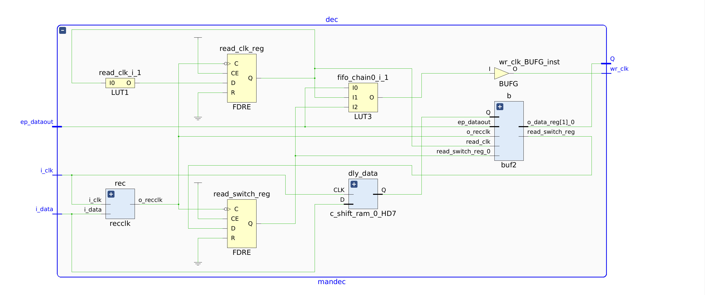

# Manchester decoder

`mandec` (`hdl/source/design/mandec/mandec.v`) recovers a clock from the
Manchester signal and emits decoded bits. Both channels instantiate it
identically; only the input pin differs.

## Clock recovery

The circuit follows [US5245635A](https://patents.google.com/patent/US5245635A/en).
`dly_data` delays the input by a fixed number of 400 MHz `genClk` ticks, and the
XOR of the input with its delayed copy marks every transition:

```verilog
assign o_clk = ~i_reset | (read_clk ^ read_switch);
```

The delay must be **a quarter of the bit period** — half a chip. It is set by
the `Depth` of the `c_shift_ram_0` IP, shared by both decoders:

$$\text{rate (MHz)} = \frac{100}{\text{Depth}}$$

Each recovered edge produces two samples per bit (before and after the mid-bit
transition). Those land in a 2-bit buffer `buf2`, and the output clock is masked
so it toggles once per bit **and only when the pair is not `00` or `11`** — a
Manchester violation. That masking is the decoder's built-in error check.

!!! danger "The recovered clock stops when the input goes idle"
    `read_switch` updates only on a `00`/`11` symbol, and it updates so as to
    cancel the XOR. With a static input the recovered clock does not free-run —
    **it stops.** That is inherent to the circuit, not a fault, but every FIFO
    clocked by it stops too, which is why those FIFOs need a sequenced reset —
    see [The FIFO reset sequencer](reset-sequencer.md).



## Manchester convention

The two conventions differ in which half of the chip pair carries the bit:

| Convention | Recovered bit | `01` → | `10` → |
|---|---|---|---|
| `normal` | `pair[1]` | 0 | 1 |
| **IEEE** | `pair[0]` | 1 | 0 |

They produce **inverted** data from the same signal. Picking the wrong one does
not look like inversion — it looks like the preamble is missing and the stream
is corrupt.

Selected once for both channels by a localparam in `USBInterface.v`:

```verilog
localparam MANCHESTER_IEEE = 1'b1;   // 1 = IEEE, matches the current transmitters
```

All bitfiles in this repo are **IEEE**, which is what the miniscope transmitters
use. Bitfile names carry the convention (`...-IEEE.bit`).

## Changing the rate

Rate applies to **both channels** — one `c_shift_ram_0` feeds both decoders.

| Rate | Depth | | Rate | Depth |
|---|---|---|---|---|
| 8.33 MHz | 12 | | 20 MHz | 5 |
| 10 MHz | 10 | | 25 MHz | 4 |
| 12.5 MHz | 8 | | 33.33 MHz | 3 |
| 14.29 MHz | 7 | | 50 MHz | 2 |
| 16.67 MHz | 6 | | | |

Not every rate is reachable, since `Depth` is an integer. Use
[`build_bitfile.tcl`](../build/building.md) rather than editing the IP by hand —
it forces the IP to regenerate, which a manual edit does not always do.

Tolerance to an off-nominal transmitter shrinks as the rate goes up, and it is
asymmetric: a transmitter running fast breaks decoding before one running slow.
