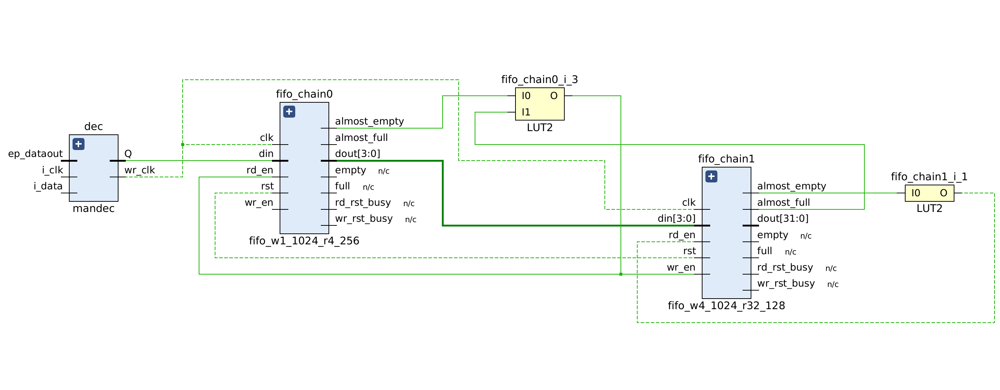
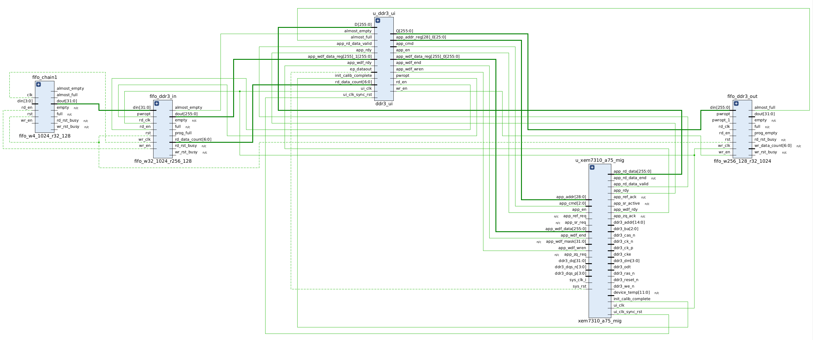
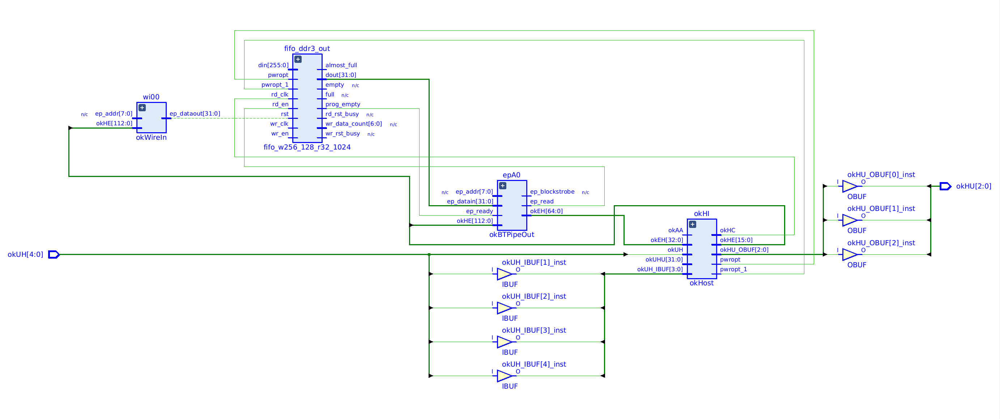

# Signal chain

Both channels do the same thing up to the point where they are buffered. The
asymmetry after that is the single most important fact about this design, and
it explains most of its behaviour.

## Inputs

The board has a 200 MHz oscillator (`sysClkp`/`sysClkn`), doubled to a 400 MHz
`genClk` that clocks the decoders. Each channel takes one single-ended 3.3 V
Manchester line:

- **Channel 1** on J2-2 → FPGA pin `Y6`
- **Channel 2** on J2-4 → FPGA pin `AA6`

!!! note "These two pins are a differential pair"
    `Y6` and `AA6` are `B34_L18P` and `B34_L18N` — the most tightly coupled
    trace pair on the connector. Using them as two independent single-ended
    inputs is legal, but expect crosstalk to be the first suspect if the two
    channels interfere at high rates. At 8.33 MHz no crosstalk has been
    observed.

## Per channel

```
manchester ──▶ mandec ──▶ 1→4 bit FIFO ──▶ 4→32 bit FIFO ──▶ [ buffer ] ──▶ okBTPipeOut
                  │                                                              │
               dec_clk (recovered, stalls when idle)                       okClk (USB)
```

`mandec` recovers a clock from the data and emits one bit per recovered edge.
The FIFO chain widens that single bit to the 32-bit words the USB pipe moves.
See [Manchester decoder](decoder.md) for how the recovery works.

## Where they diverge

=== "Channel 1"

    ```
    ... ──▶ fifo_ddr3_in ──▶ DDR3 (via MIG) ──▶ fifo_ddr3_out ──▶ pipe 0xA0
    ```

    The DDR3 cache absorbs host stalls of many seconds. Critically, the FIFO
    that gates the host read (`fifo_ddr3_out`) is written on `ui_clk`, the DDR3
    user-interface clock, which **free-runs**.

=== "Channel 2"

    ```
    ... ──▶ fifo2_out (65536 x 32 bit block RAM) ──▶ pipe 0xA1
    ```

    No DDR3. The block-RAM FIFO *is* the whole buffer: 256 KB, about 250 ms at
    8.33 Mbit/s. And it is written on `dec2_clk`, a **recovered clock that stops
    when the transmitter does**.

That second difference — a pipe-out FIFO whose write clock can stop — is what
made channel 2 fail for years. See
[The FIFO reset sequencer](reset-sequencer.md).

## Host interface

All Opal Kelly endpoints are OR'd into the `okHost` core:

| Endpoint | Direction | Purpose |
|---|---|---|
| `okWireIn` 0x00 | in | resets, see [Pinout](../reference/pinout.md#wirein-0x00) |
| `okBTPipeOut` 0xA0 | out | channel 1 data |
| `okBTPipeOut` 0xA1 | out | channel 2 data |

`okWireOR` is instantiated with `N = 2` and channel 2's endpoint occupies
`okEHx[129:65]`.

## Schematics

The FIFO chain that widens one decoded bit into 32-bit words:



Channel 1 only — the DDR3 cache and its MIG user-interface logic:



The Opal Kelly host side, shared by both channels:


